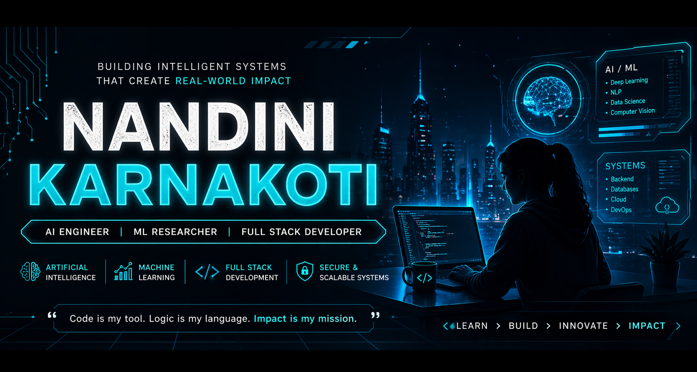

  

  

  
  
  

  <i>Designing intelligent systems that create real-world impact</i>

---

## 🧠 SYSTEM DASHBOARD

👩‍💻 AI & Data Science Student • Building Intelligent Systems • Research-Driven Mindset • Real-World Impact  

⚡ Machine Learning • Full Stack Development • Secure Systems • Data Engineering  

---

## 🚀 WORKSPACE

🧪 Earthquake Prediction (Springer) • Movie Recommender (IEEE) • OCR + Conversational AI • IoT Soil Monitoring  

💼 MassMutual — RPA • Infosys — Market Mix Models • Microsoft + SAP — AI Assistant • NIELIT — ML  

## 🏆 PERFORMANCE METRICS

1700+ Problems Solved • LeetCode 1700 • Rank 1 on College Leaderboard (CampusTechTrack) 

Research Publications • Internships • Strong DSA  

---

## ⚙️ TECH STACK

  

---

## 📄 PUBLICATIONS

🔗 <a href="https://digitalmanuscriptpedia.com/conferences/index.php/DMP-LNCSE/article/view/141">
Automated Student Document Analysis & Query System (OCR + Conversational AI)
</a> 

🔗 <a href="https://ieeexplore.ieee.org/document/10940613">
Hybrid Movie Recommendation using CNN & Traditional Algorithms (IEEE)
</a> 

🔗 <a href="https://www.deepscienceresearch.com/dsr/catalog/book/73">
Seismic Data Analysis & Earthquake Prediction using ML (Springer)
</a>

---

## 📈 ACTIVITY VISUALIZATION

  

---

## 🐍 LIVE ACTIVITY STREAM

  

---

## 💭 SYSTEM PHILOSOPHY

  <i>Exploring patterns, building intelligence, solving what matters.</i>

---

  <i>Learn. Build. Innovate. Repeat.</i>

